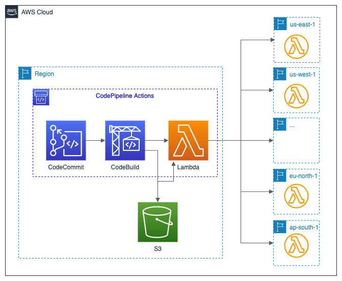
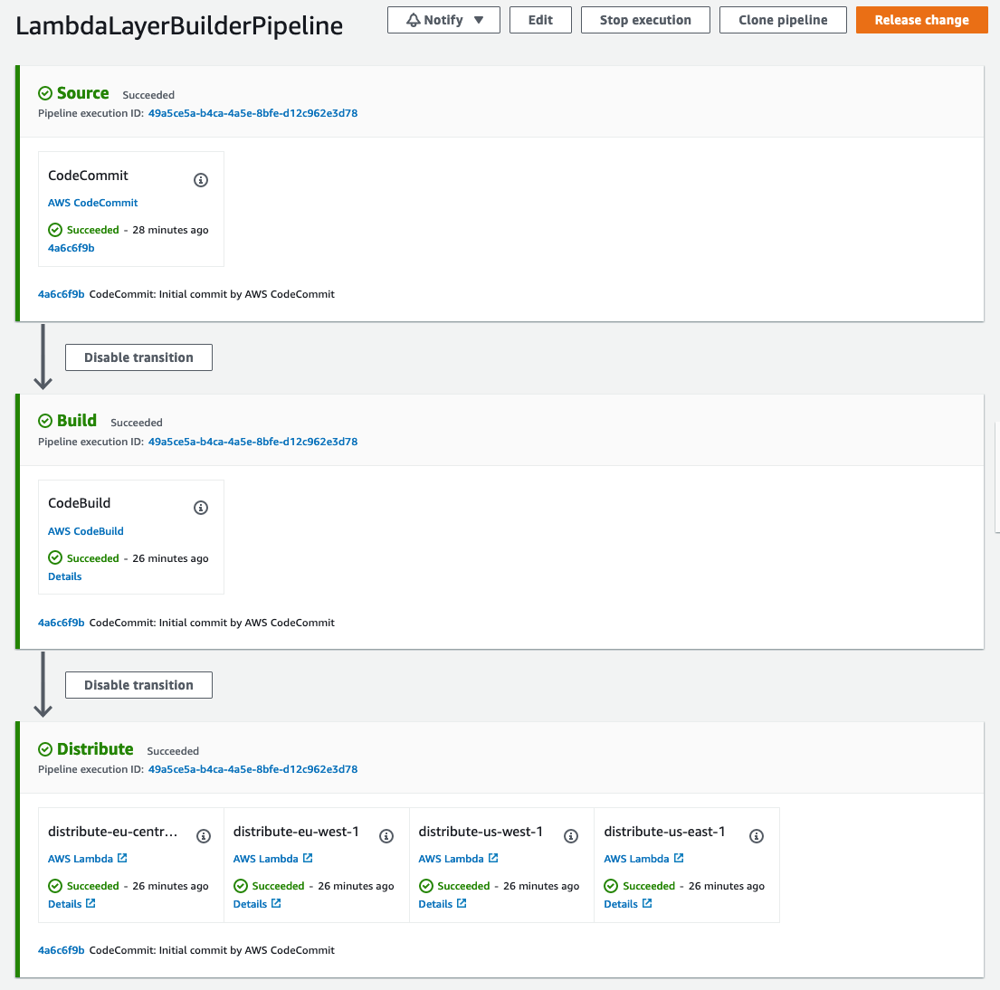

# Deploying AWS Lambda Layers automatically across multiple regions

This repository contains the full source code that is used in the blog post [Deploying AWS Lambda layers automatically across multiple Regions](https://aws.amazon.com/blogs/compute/deploying-aws-lambda-layers-automatically-across-multiple-regions/).

## Solution Overview



### Prerequisites

- An [AWS account](https://signin.aws.amazon.com/signin?redirect_uri=https%3A%2F%2Fportal.aws.amazon.com%2Fbilling%2Fsignup%2Fresume&client_id=signup)
- Installed and authenticated [AWS CLI](https://docs.aws.amazon.com/en_pv/cli/latest/userguide/cli-chap-install.html) (authenticate with an [IAM](https://docs.aws.amazon.com/IAM/latest/UserGuide/getting-started.html) user or an [AWS STS](https://docs.aws.amazon.com/STS/latest/APIReference/Welcome.html) Security Token)
- Installed and setup [AWS Cloud Development Kit (AWS CDK)](https://docs.aws.amazon.com/cdk/latest/guide/getting_started.html)
- Installed Node.js, TypeScript and git


### Let’s get you started

#### 1. Make sure you completed the prerequisites above and cloned this repo.

```
git clone git@github.com:aws-samples/xxx
```

#### 2. Open the repository in your preferred IDE and familiarize yourself with the structure of the project.

```
.
├── cdk             CDK code that defines our environment
├── img             Images used in this README
├── res             Sample code used to initialize the repository
└── src
    ├── example     Contains a sample package.json which can by used to create a new sample layer 
    └── lambda      Handler code of the lambda function used to distribute the Lambda layer
```


#### 3. Install dependencies

node.js dependencies are declared in a `package.json`.
This project contains a `package.json` file in two different folder: 
- `cdk`: Dependencies required to deploy your stack with the CDK
- `src`: Dependencies required for the Lambda function, i.e. TypeScript types for AWS SDK 

Navigate to each of the folders and run `npm install`

#### 4. Configure your stack (optional)

Open `cdk/bin/lambda-layer-blog.ts` and adjust the regions to deploy the layer in as well as the principal with whom the layer is shared.

```
// List of regions to distribute the Lambda layer to
regionCodesToDistribute: ['eu-central-1', 'eu-west-1', 'us-west-1', 'us-east-1'],
// Grants layer usage permission to either an individual AWS account (by id) 
// or all Amazon Web Services accounts '*' (if organizationId is not specified)
layerPrincipal: cdk.Aws.ACCOUNT_ID,
// Limits usage permissions to all accounts in the organization if id is specified
organizationId: '',
```

#### 5. Deploy your application

Navigate to the `cdk` folder and run the following commands

```
cdk synth 
cdk bootstrap
cdk deploy
```

`cdk synth` will synthesize a CloudFormation template from your CDK code. If you haven't worked with CDK in your account before, you need to bootstrap the required resources for the CDK with `cdk bootstrap`, otherweise skip this step. You can then deploy the template with `cdk deploy`.

If you navigate to CodePipeline in the AWS console, you will now see the following pipeline:




#### 6. Adjust your layer content

The CodeCommit repository contains a sample `package.json` file which defines the AWS SDK for Javascript for demonstration purposes. The created layer doesn't add any value because the SDK is already provided with the AWS Lambda runtime. To provide a more useful layer, update `package.json` in the repository with the file provided in `src/example` for example. This will create a layer with the latest version of the ASK SDK for Alexa.

## Cleaning up

When you are done, make sure to clean everything up.

Run the following command to shut down the resources created in this workshop.

```
cdk destroy
```
The S3 bucket created by CodePipeline will contain some files. Cloudformation does not delete non-empty buckets and thus `cdk destroy` will not delete those buckets.

If you no longer need these files, you can use the AWS CLI or console to empty the bucket and delete it.

Similarily, the AWS Lambda layers that were created by running the pipeline need to be manually removed if not needed anymore. 

## Security

See [CONTRIBUTING](CONTRIBUTING.md#security-issue-notifications) for more information.

## License

This library is licensed under the MIT-0 License. See the LICENSE file.
